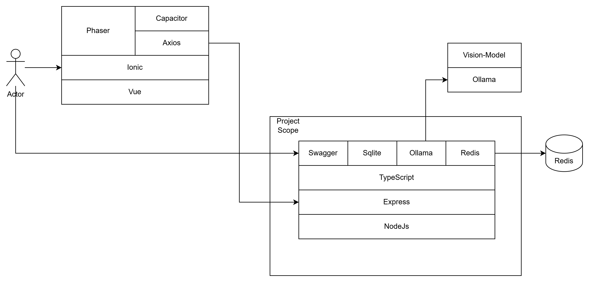

## 1. Overview
Frontend and Backend are separated and the backend is implemented with Express and TypeScript. The frontend is implemented with Vue3, Vite and Phaser. 
The frontend and backend are connected through the API. In order to test the API, Swagger is used. 
Received Data is stored in the Redis Cache or SQLite3 local database.

## 2. Architecture


## 3. Frameworks and Libraries
```
- Express
- typescript
- sqlite3
- ioredis
- swagger
```

## 4. Docker container creation and execution command
```
docker-compose build --no-cache
docker build -t node-api:local . && docker run -p 5000:3000 node-api:local
```

## 5. Execute command
```
npm run dev
```

## 6. Install commands
```
npm i typescript // 타입스크립트 설치
npm init -y   // package.json 파일 생성
npm i -D express ts-node nodemon @types/node @types/express // express, ts-node, nodemon, @types/node, @types/express 설치
npx tsc --init // tsconfig.json 파일 생성

npm i swagger-ui-express swagger-jsdoc // swagger 설치
npm i swagger-autogen // swagger-autogen 설치 https://swagger-autogen.github.io/docs/

npm i --save-dev @types/cookie-parser 
npm i --save-dev @types/morgan
npm i --save-dev @types/debug
npm i --save-dev @types/swagger-jsdoc
npm i --save-dev @types/swagger-ui-express 
```

## 7. Better SQLite3 API
```
https://github.com/WiseLibs/better-sqlite3/blob/master/docs/api.md#api
```